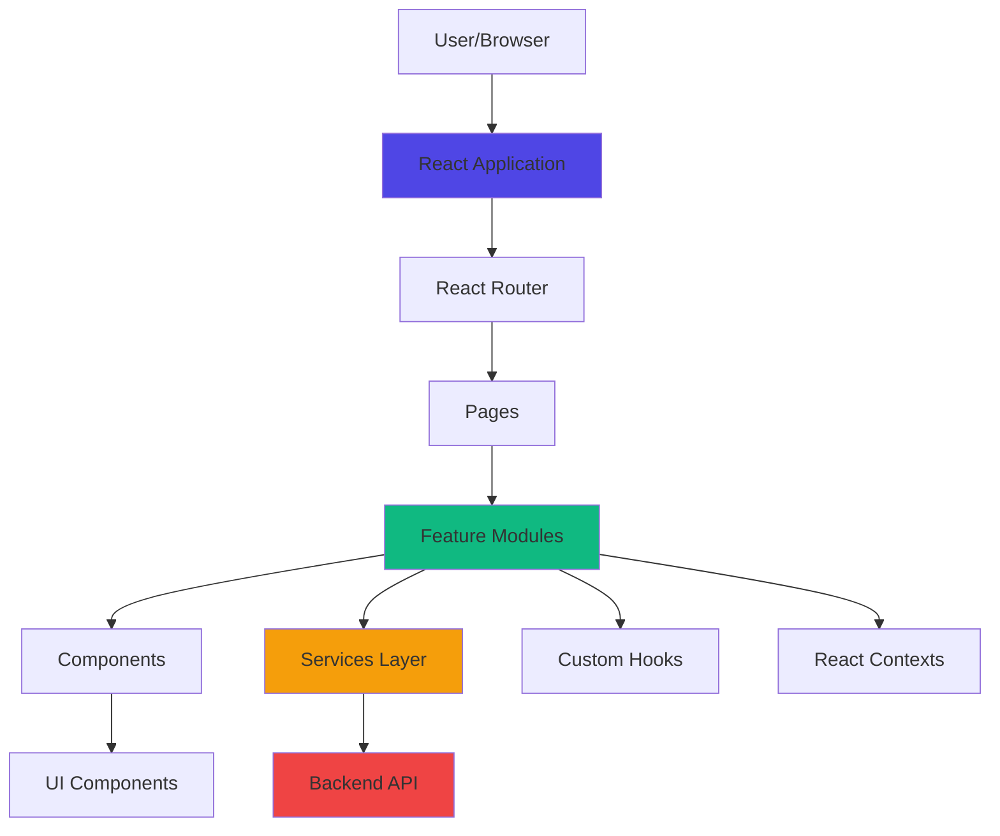
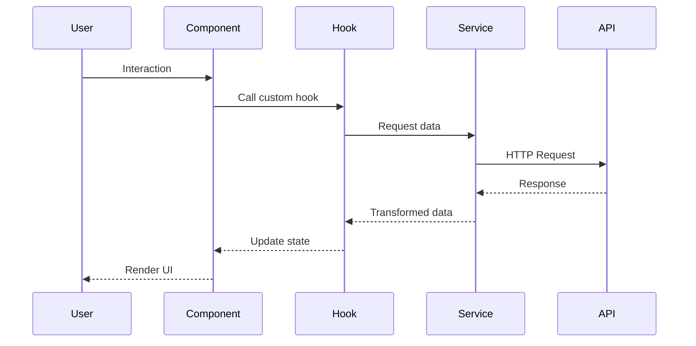
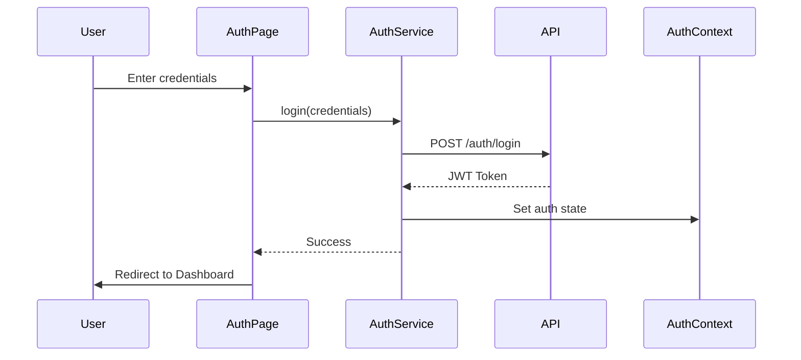

# System Architecture

Overview of the MEDSTARGENX system architecture.

## Architecture Overview

MEDSTARGENX follows a modern **Single Page Application (SPA)** architecture built with React and TypeScript.



## Layer Architecture

### 1. Presentation Layer

**Components & Pages**
- React functional components
- TypeScript for type safety
- Tailwind CSS for styling
- shadcn-ui component library

**Responsibilities:**
- Render UI
- Handle user interactions
- Display data
- Route navigation

### 2. Business Logic Layer

**Features & Hooks**
- Feature-based organization
- Custom React hooks
- State management with React Query
- Form handling with React Hook Form

**Responsibilities:**
- Business logic
- Data transformation
- State management
- Validation

### 3. Data Access Layer

**Services**
- API client configuration
- HTTP request handling
- Response transformation
- Error handling

**Responsibilities:**
- API communication
- Data fetching
- Caching (via React Query)
- Request/response interceptors

## Data Flow



## State Management Strategy

### Local State
- Component-level state with `useState`
- Form state with React Hook Form

### Global State
- Authentication state via Context API
- Theme preferences via Context API

### Server State
- Data fetching with TanStack Query (React Query)
- Automatic caching and revalidation
- Optimistic updates

### URL State
- Route parameters
- Query parameters

## Component Architecture

```
Page Component
├── Layout Component
│   ├── Header
│   ├── Sidebar
│   └── Footer
├── Feature Components
│   ├── Business Logic
│   ├── Custom Hooks
│   └── UI Components
└── Shared Components
    └── UI Library (shadcn-ui)
```

## Routing Architecture

**Client-Side Routing** with React Router DOM:

```
/ (Index)
├── /dashboard
├── /auth
├── /patient/:id
├── /records
├── /research
├── /settings
├── /pricing
└── /* (404)
```

**Route Protection:**
- Public routes: Index, Auth, Pricing
- Protected routes: Dashboard, Patient, Records, Research, Settings

## Authentication Flow



## Technology Stack Details

### Core Technologies
- **React 18.3** - UI library
- **TypeScript 5.8** - Type safety
- **Vite 5.4** - Build tool and dev server

### UI & Styling
- **Tailwind CSS 3.4** - Utility-first CSS
- **shadcn-ui** - Component library (Radix UI)
- **Lucide React** - Icon library

### Data Management
- **TanStack Query** - Server state management
- **React Hook Form** - Form handling
- **Zod** - Schema validation

### Routing & Navigation
- **React Router DOM 6.30** - Client-side routing

### Charts & Visualization
- **Recharts** - Data visualization

## Build & Deployment

### Development
```bash
npm run dev
```
- Vite dev server with HMR
- Fast refresh
- Source maps

### Production Build
```bash
npm run build
```
- TypeScript compilation
- Asset optimization
- Code splitting
- Tree shaking
- Minification

### Build Output
```
dist/
├── assets/
│   ├── index-[hash].js
│   ├── index-[hash].css
│   └── [other-chunks].js
└── index.html
```

## Performance Optimizations

### Code Splitting
- Route-based code splitting
- Dynamic imports for heavy components
- Lazy loading

### Caching Strategy
- React Query for server state caching
- Browser caching for static assets
- Service worker (future enhancement)

### Bundle Optimization
- Tree shaking unused code
- Minification
- Compression (gzip/brotli)

## Security Considerations

### Authentication
- JWT token-based authentication
- Secure token storage
- Token expiration handling
- Refresh token mechanism

### Data Protection
- HTTPS only in production
- XSS prevention (React's built-in)
- CSRF protection
- Input validation with Zod

### Environment Variables
- Sensitive data in environment variables
- Never commit `.env.local`
- Use `.env.example` as template

## Scalability

### Horizontal Scalability
- Stateless frontend application
- CDN for static assets
- API load balancing

### Code Scalability
- Feature-based architecture
- Clear separation of concerns
- Modular components
- Reusable utilities

## Future Enhancements

### Planned Features
- [ ] Progressive Web App (PWA)
- [ ] Offline support
- [ ] Real-time updates (WebSocket)
- [ ] Advanced analytics
- [ ] Multi-language support (i18n)
- [ ] Dark mode enhancement

### Technical Improvements
- [ ] E2E testing (Playwright/Cypress)
- [ ] Unit testing (Vitest)
- [ ] Storybook for component documentation
- [ ] Performance monitoring
- [ ] Error tracking (Sentry)

---

This architecture is designed to be maintainable, scalable, and performant while following React and TypeScript best practices.
